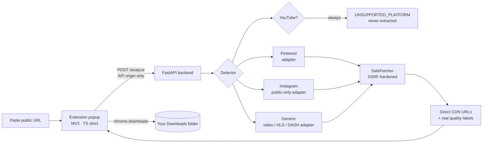

<div align="center">

# 📥 MediaSaver

**Detect and save public media from Pinterest, Instagram & direct pages — the downloader that refuses to misbehave.**

[](https://developer.chrome.com/docs/extensions/mv3/intro/)
[](backend/)
[](backend/app/main.py)
[](extension/src/)
[](backend/tests/)
[](extension/tests/)
[](backend/app/adapters/youtube_guard.py)

Paste a public link → pick **Format** + **Quality** (`720p HD`, `1080p Full HD`, `4K`…) → save it.
No logins, no bypasses, no proxying — the backend returns direct URLs, your browser does the download.

[Quickstart](#-quickstart) · [How it works](#-how-it-works) · [What it won't do](#-what-this-project-intentionally-does-not-support-and-why) · [API](#-api) · [Security](docs/manual-security-checklist.md)

</div>

---

## ✨ Features

| | |
|---|---|
| 🎯 **Paste-a-link detection** | Pinterest pins, Instagram public posts/reels, raw video pages, HLS/DASH streams |
| 🎞 **Real quality tiers** | Every rendition the platform itself serves — labeled `240p` → `8K`, with codec tags (`· AV1`, `· HEVC`) when tiers collide. Never invented, never transcoded |
| 🎛 **Format + Quality pickers** | One section per media type — choose container and tier, download once. No 60-row button lists |
| 🛡 **SSRF-hardened backend** | Every adapter is forced through one audited fetch layer: DNS-before-connect, per-hop redirect re-validation, size caps, timeouts |
| 🔒 **Minimal permissions** | `downloads` + `storage` only, API-scoped hosts, no content scripts, no `<all_urls>` ([justifications](extension/PERMISSIONS.md)) |
| 🚫 **Policy-safe by construction** | YouTube refused by policy, login walls answered `ACCESS_DENIED`, DRM answered `PROTECTED_CONTENT` |
| 📴 **Private by default** | History lives in `chrome.storage.local` (platform + filename + timestamp — URLs never stored). Logs carry hash prefixes, never full URLs |

## 🧭 How it works



> The backend is a **directory, not a distributor**: it never downloads, stores, or proxies media bytes — it returns metadata, and the extension performs the save.

## 🚀 Quickstart

**Backend** — needs Python 3.12+:

```powershell
cd backend
pip install -r requirements.txt
copy .env.example .env   # optional; defaults are safe
python -m uvicorn app.main:app --port 8000
python -m pytest tests -q   # 94 passed
```

Or Docker: `docker build -t mediasaver backend && docker run -p 8000:8000 mediasaver`

**Extension** — needs Node 20+:

```powershell
cd extension
npm install
npm test                                   # 42 passed
$env:VITE_API_BASE="http://localhost:8000"; npm run build
```

Then `chrome://extensions` → Developer mode → **Load unpacked** → `extension/dist`.
Open the popup → ⚙ → **Test connection** → *Backend reachable*. Paste a link → Analyze → pick Format + Quality → Download.

Release builds: `$env:VITE_API_BASE="https://api.mediasaver.example"; npm run build:store`
(localhost is stripped and a fail-closed gate fails the build if any dev string leaks into `dist/`).

## 🗂 Project structure

```
mediasaver/
├── backend/
│   ├── app/
│   │   ├── fetcher.py          # ← the SSRF-hardened layer every adapter must use
│   │   ├── detector.py         # URL → adapter routing (+ YouTube refusal first)
│   │   ├── schemas.py          # Pydantic contracts + 13-code error enum
│   │   ├── rate_limit.py       # per-IP sliding window (20/min, env-tunable)
│   │   ├── main.py             # FastAPI routes: /health /platforms /analyze
│   │   └── adapters/
│   │       ├── pinterest.py    # public pins: images, video renditions, V_ blocks
│   │       ├── instagram.py    # public posts/reels only, fragile-by-nature
│   │       ├── generic.py      # raw video, OG meta, HLS/DASH, embedded file URLs
│   │       ├── quality.py      # honest labels: dims/URL tokens → 720p HD, 4K…
│   │       └── youtube_guard.py# hard refusal, with the reason spelled out
│   └── tests/                  # 94 tests: SSRF battery, adapters, API contracts
├── extension/
│   ├── src/                    # popup, API client, errors map, history, settings
│   ├── PERMISSIONS.md          # one-line justification per manifest permission
│   └── tests/                  # 42 tests: all UI states, selection, privacy
├── docs/
│   └── manual-security-checklist.md  # pre-release runbook (SSRF battery, store checks)
├── PRIVACY.md                  # what we collect (almost nothing) and why
└── README.md                   # you are here
```

## 🛡 Why a reviewer can trust it fast

- **`backend/app/fetcher.py`** is the single file that matters: scheme allowlist, default ports only, DNS-before-connect with private/reserved-IP rejection, **per-hop redirect re-validation**, timeouts, streaming size cap (headers never trusted), concurrency semaphore, no cookie jar. Adapters *cannot* make their own HTTP.
- **YouTube is refused before any adapter runs** — with an explicit ToS reason, client-side *and* server-side.
- **Stable 13-code error contract** (`INVALID_URL`, `UNSUPPORTED_PLATFORM`, `MEDIA_NOT_FOUND`, `PRIVATE_CONTENT`, `ACCESS_DENIED`, `PROTECTED_CONTENT`, `RATE_LIMITED`, `TEMPORARY_FAILURE`, `NETWORK_ERROR`, `SERVER_ERROR`, `FILE_TOO_LARGE`, `TIMEOUT`, `UNSUPPORTED_ACCESS`) — the UI maps each to plain language and never prints backend strings.
- **Extension attack surface**: no content scripts, no `<all_urls>`, no `eval` of anything remote, no browsing-history access.

## 🚫 What this project intentionally does not support, and why

- **YouTube (all domains incl. youtu.be / nocookie embeds).** Its ToS bans third-party download tools; Web Store policy treats facilitation as removal grounds. `UNSUPPORTED_PLATFORM`, permanently.
- **Anything behind a login, paywall, or privacy setting.** `ACCESS_DENIED` instead of sessions, cookies, or credentials. No login flow, ever.
- **DRM/EME, CAPTCHAs, anti-bot evasion, signed-URL tricks.** `PROTECTED_CONTENT` / `UNSUPPORTED_ACCESS`. Circumvention would be unlawful and store-fatal.
- **Instagram login-walled or JS-only content.** Public posts only; anything else degrades honestly. No login flow, ever.
- **Facebook / X.** Real operator liability even on public posts — stays Phase 5, not an MVP shortcut.
- **Invented qualities or formats.** "All resolutions" = every rendition the platform's own delivery exposes. If only `.mp4` exists, only `.mp4` is offered.
- **Backend media proxying/storage.** Near-zero bandwidth, and never a distributor.

## 🔌 API

| Endpoint | Purpose |
|---|---|
| `GET /health` | `{ok, version}` — also powers the popup's Test-connection button |
| `GET /platforms` | Supported vs refused platform lists |
| `POST /analyze` | `{url}` → `{ok:true, data:{platform, page_url, title, thumbnail_url, variants[]}}` or `{ok:false, error, reason, platform}` |

Rate limit: **20 analyses/min/IP** (`MEDIASAVER_RATE_LIMIT_PER_MINUTE`). Full contract in [`backend/app/schemas.py`](backend/app/schemas.py).

## ✅ Verification

- **94 pytest + 42 vitest, `tsc --noEmit` strict clean**, `vite build` / `build:store` green.
- **Live-proven**: real multi-hop redirect chains (literal + DNS-name + 2-hop) all blocked; limiter exactly 20→429→rollover; store artifact ships zero dev strings; deleted pin → `MEDIA_NOT_FOUND`; real pages detected end to end.
- **Manual release procedure**: [`docs/manual-security-checklist.md`](docs/manual-security-checklist.md) — run before any Web Store submission.

## 🔐 Security disclosure

Found a hole (especially an SSRF bypass in `SafeFetcher`)? Report it **privately** to the maintainers before opening a public issue. Please don't probe it against the production API.

## 🗺 Roadmap

- [x] MVP: Pinterest + generic video/HLS/DASH + hardened core
- [x] Instagram public posts (fragile, documented)
- [x] Real quality labels + Format/Quality pickers
- [ ] Facebook / X public adapters (explicit fragility handling)
- [ ] Chrome Web Store release (checklist complete → listing + screenshots)
- [ ] Multi-replica rate limiting (Redis swap documented in code)

---

<div align="center">
Built to last in the store, not to burn in a week. ⭐ if you like downloaders with boundaries.
</div>
# MediaSea

